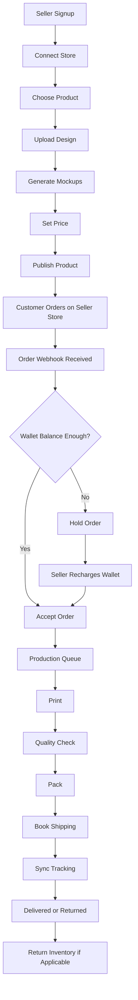

# Master PRD: Overview

## Product Name

Working name: POD OS.

## Product Objective

Build a full-stack SaaS and operations system that allows online sellers to create print-on-demand products, publish them to Shopify or WooCommerce, receive customer orders automatically, pay production charges through a prepaid wallet, track fulfillment in real time, and manage returned inventory.

The platform must also provide internal systems for admin, factory, warehouse, packing, shipping, finance, and support teams.

## Core Workflow

## Required Platforms

Seller-facing platforms:

- Web app.
- Shopify connector.
- WooCommerce connector.
- Mobile app later.

Internal platforms:

- Admin portal.
- Factory portal.
- Warehouse portal.
- Packing station view.
- Dispatch view.
- Finance dashboard.
- Support dashboard.

## User Roles

Seller roles:

- Seller owner.
- Seller staff.
- Seller finance user.
- Seller support user.

Internal roles:

- Super admin.
- Admin manager.
- Product manager.
- Operations manager.
- Print operator.
- Quality control operator.
- Packing operator.
- Dispatch operator.
- Support agent.
- Finance manager.

## Main System Requirements

- Every important action must be logged.
- Every money movement must have a ledger entry.
- Every external webhook must be idempotent.
- Every connector failure must enter a retry queue.
- Every production job must be traceable.
- Every file upload must be stored securely.
- Every seller must be isolated from other sellers.
- Admin actions must have audit logs.
- System must support future marketplace connectors.
- System must support future multi-factory routing.
